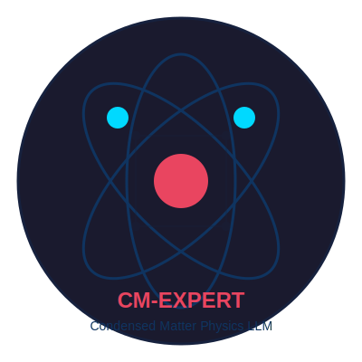

# CondensAI

<div align="center">
  
  <br>
  <strong>Build Domain-Expert LLMs for Condensed Matter Physics</strong>
</div>

<p align="center">
  <a href="https://github.com/Houchen181/CondensAI/stargazers">
    
  </a>
  <a href="https://github.com/Houchen181/CondensAI/issues">
    
  </a>
  <a href="https://github.com/Houchen181/CondensAI/blob/main/LICENSE">
    
  </a>
  <a href="https://arxiv.org/abs/2508.18124">
    
  </a>
</p>

**CondensAI** is an open-source toolkit for building **domain-expert LLM assistants** specialized in condensed matter physics. Turn your research papers, textbooks, and lecture notes into an intelligent, retrieval-augmented Q&A system that actually understands physics.

> **Why this exists:** Most physicists shouldn't need to be ML engineers. This project lets you deploy a custom LLM trained on *your* research area鈥攚ithout requiring a team of AI experts.

---

## 馃幆 What Can You Do?

- **Build a physics tutor** from your favorite textbooks and lecture notes
- **Create a paper Q&A bot** for your research group's publications
- **Deploy a lab assistant** that knows your experimental protocols
- **Evaluate LLM physics knowledge** with CMPhysBench benchmarks
- **Fine-tune efficiently** with LoRA (parameter-efficient, works on consumer GPUs)

---

## 馃殌 Quick Start

### 1. Install
```bash
git clone https://github.com/Houchen181/CondensAI.git
cd CondensAI
pip install -r requirements.txt
```

### 2. Prepare Your Data
Place condensed matter physics documents in `data/raw/`:
- arXiv papers (cond-mat)
- Textbook chapters
- Lecture notes
- Research summaries

```bash
# Example: Add a sample file
echo "# Superconductivity\n\nThe Meissner effect..." > data/raw/superconductivity.md
```

### 3. Build Corpus
```bash
python scripts/build_corpus.py --input-dir ./data/raw --output-file ./data/processed/sft.jsonl
```

### 4. Train LoRA Adapter
```bash
python scripts/train_lora.py --config configs/train.default.yaml
```
*Dry-run mode enabled by default (`DRY_RUN=1`) for safe config validation.*

### 5. Evaluate
```bash
python scripts/run_eval.py --all
```

### 6. Deploy RAG API
```bash
python scripts/serve_api.py --config configs/serve.default.yaml
```
Access the interactive API docs at `http://localhost:8080/docs`

---

## 馃摎 Tutorials

| Tutorial | Description | Notebook |
|----------|-------------|----------|
| **Data Ingestion** | Build your physics corpus from papers & textbooks | [`01_data_ingestion.ipynb`](examples/01_data_ingestion.ipynb) |
| **LoRA Training** | Fine-tune with parameter-efficient adapters | [`02_training.ipynb`](examples/02_training.ipynb) |
| **Benchmark Evaluation** | Test with CMPhysBench questions | `scripts/run_eval.py --benchmark` |
| **RAG Deployment** | Deploy production API with health checks | `scripts/serve_api.py` |

---

## 馃敩 Key Features

### Data Pipeline
- 鉁?Automatic chunking with configurable size/overlap
- 鉁?Metadata extraction (source, type, char count)
- 鉁?JSONL output format for HuggingFace compatibility
- 鉁?Supports `.txt`, `.md`, `.tex` files

### Training
- 鉁?LoRA fine-tuning (r=32, alpha=64, target_modules=[q,v,k,o]_proj)
- 鉁?Optional DAPT (Domain Adaptive Pre-Training) stage
- 鉁?YAML-based configuration
- 鉁?Dry-run mode for safe validation
- 鉁?GPU detection and graceful degradation

### Evaluation
- 鉁?CMPhysBench benchmark (5 sample questions included)
- 鉁?Grounding evaluation (hallucination detection)
- 鉁?Citation accuracy metrics
- 鉁?By-difficulty and by-topic breakdowns

### Serving
- 鉁?HybridRetriever (BM25 + dense placeholder)
- 鉁?Reciprocal Rank Fusion for combining rankings
- 鉁?FastAPI endpoints (`/retrieve`, `/query`, `/stats`, `/health`)
- 鉁?Health checks with retriever status

---

## 馃搳 Latest Research Integration

This project incorporates insights from cutting-edge work in scientific AI:

- **SAGA** (Du et al., Dec 2025): Autonomous goal-evolving agents for scientific discovery
- **PhysMaster** (Miao et al., Dec 2025): Building autonomous AI physicists for theoretical research
- **MaterialsGalaxy** (Zhu et al., Oct 2025): Fusing experimental and theoretical condensed matter data
- **CMPhysBench** (2025): Benchmark for condensed matter physics LLM evaluation

*These papers validate our hybrid approach: domain-specific training data + retrieval augmentation + efficient fine-tuning.*

---

## 馃彈锔?Project Structure

```
CondensAI/
鈹溾攢鈹€ src/cmp_expert/
鈹?  鈹溾攢鈹€ data/            # Data ingestion pipeline
鈹?  鈹溾攢鈹€ training/        # LoRA training with DAPT support
鈹?  鈹溾攢鈹€ eval/            # CMPhysBench + Grounding evaluation
鈹?  鈹斺攢鈹€ serve/           # RAG API (FastAPI)
鈹溾攢鈹€ configs/             # YAML configurations
鈹溾攢鈹€ scripts/             # CLI tools
鈹溾攢鈹€ data/raw/            # Sample physics content
鈹?  鈹溾攢鈹€ superconductivity/
鈹?  鈹溾攢鈹€ topology/
鈹?  鈹斺攢鈹€ correlated/
鈹溾攢鈹€ examples/            # Interactive tutorials (Jupyter)
鈹溾攢鈹€ docs/                # Documentation + logo
鈹斺攢鈹€ tests/               # Unit tests
```

---

## 馃帗 Example Use Cases

### 1. Research Group Paper Bot
Train on your group's publications + internal notes. New students can ask: *"What's our approach to measuring topological invariants?"*

### 2. Textbook Companion
Load chapters from Ashcroft & Mermin or Kittel. Students query: *"Explain the Meissner effect in simple terms."*

### 3. Lab Protocol Assistant
Ingest experimental procedures and troubleshooting guides. Lab members ask: *"Why is my STM signal noisy?"*

---

## 馃洜锔?Configuration

### Training Config (`configs/train.default.yaml`)
```yaml
base_model: mistralai/Mistral-7B-Instruct-v0.3
train_file: ./data/processed/sft.jsonl
output_dir: ./artifacts/lora-cmp
lora:
  r: 32
  alpha: 64
  dropout: 0.05
  target_modules: ['q_proj', 'v_proj', 'k_proj', 'o_proj']
training:
  epochs: 3
  lr: 2e-4
  batch_size: 2
  grad_accum: 16
  max_length: 4096
```

---

## 馃搱 Roadmap

### Completed 鉁?- [x] Data ingestion pipeline
- [x] LoRA training with DAPT support
- [x] CMPhysBench evaluation
- [x] Hybrid RAG serving layer
- [x] Example notebooks and documentation

### In Progress 馃敡
- [ ] Dense vector retrieval (sentence-transformers)
- [ ] Cross-encoder reranking
- [ ] UI frontend (Streamlit/Gradio)
- [ ] Docker deployment
- [ ] Extended CMPhysBench questions
- [ ] Continuous arXiv monitoring

---

## 馃 Contributing

We welcome contributions! See [`CONTRIBUTING.md`](CONTRIBUTING.md) for guidelines.

**Wanted:**
- More condensed matter physics examples
- Additional benchmark questions
- UI/UX improvements
- Docker deployment scripts

---

## 馃搫 License

Apache License 2.0 - See [LICENSE](LICENSE) for details.

---

## 馃檹 Acknowledgments

- **CMPhysBench** team for the evaluation benchmark
- **Hugging Face** for transformers, peft, and datasets libraries
- **FastAPI** for the serving framework
- Condensed matter physics community for open research papers

---

## 馃摤 Contact

- **Issues:** [GitHub Issues](https://github.com/Houchen181/CondensAI/issues)
- **Repository:** https://github.com/Houchen181/CondensAI

---

*Built with 鉂わ笍 for the condensed matter physics community*
